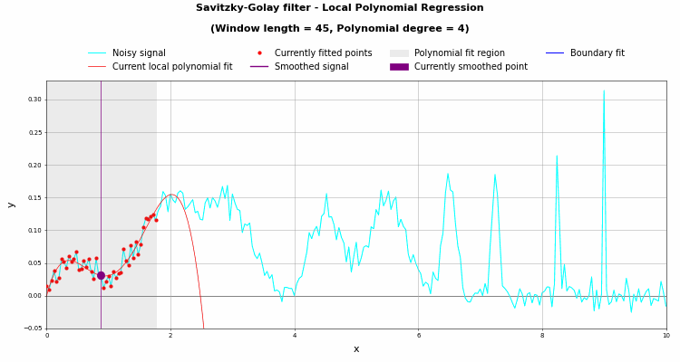
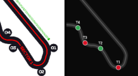

# F1 Corner Detection and Clustering

Detects all corners across a select year of the F1 calendar (2018-2025), and extracts telemetry characteristics using FastF1, then taking the telemetry and clustering all identified corners based on the telemetry characteristics.

---
`>>>` DevHCarter

`>>>` saikolisetty9632

---
## Prerequisites

```
pip install fastf1 numpy scipy scikit-learn pandas matplotlib plotly

python 3.10+
```
---

## How to Run

Run the notebooks in order:

1. `f1_corner_identification.ipynb` — detects corners and generates circuit map images
2. `corner_clustering.ipynb` — builds the feature matrix, clusters, and produces interactive outputs

Both notebooks load data from `cashe/f1_casche` (on first run, pulling all the data took ~7 minutes, after that it only takes ~20 seconds)

---

## File Structure

```
├── corner_utils.py                        # core library: curvature, detection, feature extraction
├── f1_corner_identification.ipynb         # corner detection + circuit map visualizations
├── corner_clustering.ipynb                # k-means clustering + 3D / radar / composition charts
├── Assets
│   └── Savitzky_golay_local_regression_wl045_pd04.gif
├── cache
│   ├── f1_cache                          # FastF1 telemetry cache (auto-populated on first run)
│   └── __pycache__
├── Maps 
│   ├── grid_maps                         # multi-circuit overview images
│   │   ├── corner_map_grid.png         
│   │   ├── corner_speed_grid.png         
│   │   └── circuit_cluster_maps.png      
│   └── individual_circuits               # one PNG per circuit (24 total)
│       ├── Bahrain_Grand_Prix.png
│       └── ...
└── Visualizations
    ├── corner_clusters_3d.html           # interactive 3D PCA scatter
    └── cluster_radar.html                # cluster feature radar chart
```
---

## Pipeline Overview

```
FastF1 API
    |
    v
GPS coordinates (X, Y) + telemetry (Speed, Brake, Throttle, nGear, Steering)
    |
    v
Savitzky-Golay smoothing -> signed curvature (kappa)
    |
    v
find_peaks() with binary-search calibration -> corner apex indices
    |
    v
Steering-peak fallback -> catches any corners missed by curvature
    |
    v
Per-corner feature extraction (7 clustering features)
    |
    v
StandardScaler normalization -> k-means clustering
    |
    v
PCA (7D -> 3D) -> interactive Plotly 3D scatter
```

---

## Step 1: Data Acquisition

(FastF1)[https://github.com/theOehrly/Fast-F1] is a public dataset that tracks tons of F1 related data.

Variables after loading:

| Variable | Type | Description |
|---|---|---|
| `x_raw`, `y_raw` | float array | Raw GPS coordinates in meters (circuit coordinate frame) |
| `dist` | float array | Cumulative distance along the lap in meters |
| `speed` | float array | Speed in km/h at each telemetry sample |
| `tel` | DataFrame | Full telemetry: Speed, Brake, Throttle, nGear, Distance, Steering |

---

## Step 2: GPS Smoothing and Curvature

One of the largest challenges we ran into was data availability. F1 is an extremely large global sport, and teams keep this sort of data private for the most part, but with data scraping and the desire of F1 fans, datasets like these are created.

### Savitzky-Golay Smoothing

GPS was fortunately one of the telemetry options we had access to, but the noise in the data was problematic. We used *Savitzky-Golay Smoothing* to smooth the data to be much more feasible to use for this context.

Here is a visualization of what Savitzky-Golay Smoothing is:



The post-processed data is represented by `x_s` & `y_s` for x and y coordinates respectively.


### Signed Curvature

This measures the `x_s` & `y_s` to determine the curvature between points, eventually leading to the curvature of a corner; a very important part of the data processing.

```
kappa = (x' * y'' - y' * x'') / (x'^2 + y'^2)^(3/2)
```
*prime denotes the derivative of a variable*

Sign convention:
- `kappa > 0` = left-hand corner
- `kappa < 0` = right-hand corner

The absolute value `abs_kappa = |kappa|` is used for peak detection. A Gaussian filter is then applied to further reduce noise in the data.

---

## Step 3: Corner Detection (`detect_corners`)

### Inputs

| Parameter | Description |
|---|---|
| `abs_kappa` | Smoothed absolute curvature |
| `dist` | Distance array |
| `speed` | Speed array |
| `kappa_signed` | Signed curvature (for direction) |
| `target_count` | Official corner count for this circuit |
| `min_dist_m` | Minimum spacing between two corners in meters (default 60 m) |
| `window_m` | Half-width of the feature extraction window around each apex (default 100 m) |
| `steering_arr` | Raw steering channel values (optional, used for fallback detection) |
| `steer_dist` | Distance array aligned to `steering_arr` |
| `steer_prominence` | Prominence threshold for steering-peak fallback (default 0.35) |

### Binary-Search Calibration

`scipy.signal.find_peaks` requires a `prominence` threshold: the minimum height a peak must stand above its surrounding baseline to be counted. The correct threshold to recover exactly `target_count` corners is not known a priori, so it is found by binary search:

```
lo = 40th percentile of non-zero curvature values
hi = maximum curvature value

repeat up to 60 times:
    mid = (lo + hi) / 2
    peaks = find_peaks(abs_kappa, prominence=mid, distance=min_idx_gap)
    if len(peaks) == target_count: stop
    if len(peaks) > target_count:  lo = mid   (threshold too low, too many peaks)
    if len(peaks) < target_count:  hi = mid   (threshold too high, too few peaks)

keep the iteration that produced count closest to target_count
```

`min_idx_gap` is derived from `min_dist_m` by dividing by the median sample spacing:

```
avg_spacing  = median(diff(dist))      [meters per sample]
min_idx_gap  = floor(min_dist_m / avg_spacing)
half_win     = floor(window_m / avg_spacing)
```

### Steering-Peak Fallback

When steering data is available, a second pass runs after the curvature search. The raw steering signal is normalized to [0, 1] and peaks are detected using `find_peaks` with `steer_prominence=0.35`. Any steering peak that is more than `min_dist_m` away from every already-claimed corner apex gets added as an additional corner. These corners carry `detected_by = 'steering'`; all curvature-detected corners carry `detected_by = 'curvature'`.

This catches corners that are geometrically shallow (low curvature) but still require significant steering input, such as long, sweeping bends that the curvature search can undercount.

### Corner Dictionary

Each detected corner is stored as a dict:

| Key | Type | Description |
|---|---|---|
| `corner_num` | int | Sequential number along the lap (1-indexed) |
| `apex_idx` | int | Index into the GPS/telemetry arrays at the curvature peak |
| `apex_dist` | float | Distance in meters from the start of the lap to the apex |
| `start_idx` | int | Start of the feature window: `apex_idx - half_win` |
| `end_idx` | int | End of the feature window: `apex_idx + half_win` |
| `direction` | str | `'L'` or `'R'`, from the sign of `kappa_signed` |
| `peak_kappa` | float | Absolute curvature at the apex index |
| `detected_by` | str | `'curvature'` or `'steering'` (steering-fallback corners only) |


*Note: Due to the noise and the limited public data-availilbity, there are some issues with the corner identifitcation. For example, certain tracks have fairly complex corners, that when looking at the track map, it makes sense that we identify 2 corners seperate from eachother, but in this instance, we are using telemetry, so instead of mapping the track, we are more or less mapping the racing line, which causes some corners to be missed. Suzuka turn 1-2 for example:*



---

## Step 4: Feature Extraction (`extract_features`)

For each corner a 100 m window centered on the apex is sliced from the telemetry DataFrame. The window spans `[apex_dist - 100, apex_dist + 100]` meters and must contain at least 5 telemetry samples; otherwise the corner is ignored.

### Speed Features

| Feature | Formula | Description |
|---|---|---|
| `speed_min` | `min(Speed[window])` | Apex speed in km/h; the slowest point in the window |
| `speed_mean` | `mean(Speed[window])` | Mean speed through the corner |
| `speed_entry` | `Speed[window[0]]` | Speed at the entry edge of the window |
| `speed_exit` | `Speed[window[-1]]` | Speed at the exit edge of the window |
| `speed_drop` | `speed_entry - speed_min` | Deceleration magnitude from entry to apex |

### Curvature Features

These are derived from the GPS geometry (not the driver's telemetry), so they are consistent regardless of which driver's lap is used.

| Feature | Formula | Description |
|---|---|---|
| `kappa_max` | `max(abs_kappa[start_idx:end_idx])` | Peak curvature in the window (1/m) |
| `kappa_mean` | `mean(abs_kappa[start_idx:end_idx])` | Mean curvature in the window |
| `peak_kappa` | `abs_kappa[apex_idx]` | Curvature at the exact apex index |

### Lateral G-Force Proxy

Lateral acceleration is approximated using the centripetal acceleration formula:

```
a_lat = v^2 * kappa_max
lat_g = a_lat / 9.81 = (v_ms^2 * kappa_max) / 9.81
```

Where `v_ms = Speed_kmh / 3.6`. The maximum value across the window is taken. `kappa_max` is fixed from the GPS geometry so the value reflects how fast the driver was travelling through that radius.

| Feature | Formula | Description |
|---|---|---|
| `lat_g_max` | `max((Speed/3.6)^2 * kappa_max) / 9.81` | Peak lateral G-force estimate |

### Throttle and Brake Features

FastF1's `Brake` channel is binary — 0 when the brakes are not applied, 1 when they are. `brake_frac` is therefore the fraction of telemetry samples in the window where the driver was on the brakes. `corner_type` is a categorical classification derived from that same fraction internally, before the raw mean is stored.

| Feature | Formula | Description |
|---|---|---|
| `brake_frac` | `mean(Brake[window])` | Fraction of samples in the window where brake was applied (0.0 to 1.0) |
| `throttle_mean` | `mean(clip(Throttle[window], 0, 100))` | Mean throttle percentage (clamped to 0-100) |
| `corner_type` | classification | `'flat_out'` if brake_frac < 0.05, `'light_braking'` if < 0.25, else `'heavy_braking'` |

### Steering Features

Only populated when the session provides steering data (not always available).

| Feature | Formula | Description |
|---|---|---|
| `steer_max` | `max(abs(Steering[window]))` | Peak steering angle magnitude |
| `steer_mean` | `mean(abs(Steering[window]))` | Mean steering angle magnitude |
| `steer_apex` | `abs(Steering[apex_sample])` | Absolute steering angle at the sample closest to the apex |

---

## Step 5: Feature Matrix and Preprocessing

Seven features are selected for clustering:

```
FEATURE_COLS = [
    'speed_min',      # apex speed
    'speed_drop',     # braking magnitude
    'kappa_max',      # geometric tightness
    'lat_g_max',      # lateral load
    'brake_frac',     # braking character
    'throttle_mean',  # throttle character
    'gear_apex',      # speed class proxy
]
```

### StandardScaler

k-means is an inherently distance-based algorithm. Features on different scales (e.g. speed in hundreds of km/h vs. kappa in thousandths of 1/m) would cause large-scale features to dominate the distance calculation. StandardScaler transforms each feature to zero mean and unit variance:

```
z = (x - mu) / sigma
```

Where `mu` and `sigma` are the mean and standard deviation computed across all corners in the dataset. After scaling, every feature contributes equally in the k-means algorithm.

---

## Step 6: Choosing the k Value

k-means is a distance-based algorithm, and to help that, running a few tests can help, but only in the context of racing. What I mean by that is I asked myself "How many types of corners are there?". Based on my intuition, I found that 6 was a good, representative number for our k value. The following are the cluster titles:

```
k = 6
     'Slow Hairpin',
     'Medium Corner',
     'Fast Sweeper',
     'Flat-Out',
     'Chicane / Complex',
     'High-G Medium',
```

This was confirmed by the elbow plot that we generated as well. We used 2 axes for the determination:

### Inertia

```
J = sum over clusters k:
        sum over points x in cluster k:
            ||x - c_k||^2
```

Where `c_k` is the center of cluster k. Inertia always decreases as k increases. The "elbow", the point where marginal improvement flattens out, is the natural operating point.

### Silhouette Score

For each point i:

```
a(i) = mean distance from i to all other points in the same cluster
b(i) = mean distance from i to all points in the nearest other cluster
s(i) = (b(i) - a(i)) / max(a(i), b(i))
```

Silhouette score ranges from -1 to 1. Higher is better. The k with the highest silhouette score is the most internally coherent clustering.

---

## Step 7: K-Means Clustering

```
KMeans(n_clusters=K, random_state=42, n_init=20)
```

`n_init=20` runs 20 independent random initializations and keeps the best result (lowest inertia), which reduces sensitivity to the random starting centers. `random_state=42` seeds the RNG for reproducibility.

### How K-Means Works (Lloyd's Algorithm)

1. **Initialize** — place K centroids randomly in the scaled feature space
2. **Assign** — assign every corner to the nearest centroid by Euclidean distance
3. **Update** — recompute each centroid as the mean of all corners assigned to it
4. **Repeat** steps 2-3 until assignments stop changing (convergence)

Because initialization is random, different starting centroids can produce different final clusters. Running `n_init=20` restarts guards against getting stuck in a poor local minimum.

### Cluster Label Assignment

After fitting, each corner in `df_clean` is assigned a `cluster` integer (0 to K-1). Clusters are auto-labeled by ranking their mean `speed_min` ascending, then mapping each rank to a human-readable name:

| Rank by apex speed | Label |
|---|---|
| 0 (slowest) | Slow Hairpin |
| 1 | Medium Corner |
| 2 | Fast Sweeper |
| 3 | Flat-Out |
| 4 | Chicane / Complex |
| 5 (fastest) | High-G Medium |

This means the labels are always speed-ordered regardless of which integer cluster ID k-means happens to assign, making results consistent across re-runs.

---

## Step 8: PCA Projection to 3D

Here are our dimensions again for posterity:
```
    'speed_min',      # apex speed
    'speed_drop',     # braking magnitude
    'kappa_max',      # geometric tightness
    'lat_g_max',      # lateral load
    'brake_frac',     # braking character
    'throttle_mean',  # throttle character
    'gear_apex',      # speed class proxy
```

Since we are using more than 3 dimensions, we need to use PCA to reduce the number of dimensions down to 3. Here is the formula used for generating our final 3 dimensions:

```
PC_j = w_{j,1} * speed_min + w_{j,2} * speed_drop + ... + w_{j,7} * gear_apex
```

The weight vector `[w_{j,1}, ..., w_{j,7}]` is called the loading vector for component j.

The notebook prints the two features with the largest absolute loadings for each PC, i.e. the best pairs for each dimension:

```
PC1: +throttle_mean, -brake_frac    (77.0% of variance)
PC2: +speed_drop, +gear_apex        (11.0% of variance)
PC3: +lat_g_max, +kappa_max         ( 6.9% of variance)
```

In this example, PC1 separates corners by throttle/brake character (flat-out vs. heavy braking), PC2 by deceleration and gear, and PC3 by lateral load and tightness. Together they capture ~95% of total variance.

We lose about 5% of the total variance when compressing from 7 to 3 dimensions — this is real variation between corners that exists in the 4th through 7th dimensions but gets flattened out in the projection. The clusters themselves are computed in full 7D where nothing is lost; only the visualization is affected.

---

## Step 9: Outputs

### Elbow Plot (`elbow_plot.png`)

Two-panel plot showing inertia and silhouette score for k = 2 through 10. Used to select the final k value before running the full clustering.

### Corner Direction Grid (`Maps/grid_maps/corner_map_grid.png`)

A grid of all 24 circuits with each detected corner apex marked and colored by direction (green = left, red = right). Generated by `f1_corner_identification.ipynb`.

### Speed Grid (`Maps/grid_maps/corner_speed_grid.png`)

The same 24-circuit grid with the racing line colored by speed (red = slow, green = fast) using a `LineCollection`. Corner apexes are marked and annotated with their corner number. Generated by `f1_corner_identification.ipynb`.

### Individual Circuit Maps (`Maps/individual_circuits/`)

One PNG per circuit (24 total). Each image has two panels side by side: the left panel shows corner directions, the right panel shows the speed-colored racing line with apex speeds annotated. Generated by `f1_corner_identification.ipynb`.

### Circuit Cluster Maps (`Maps/grid_maps/circuit_cluster_maps.png`)

The same 24-circuit grid as the direction grid, but with each corner apex colored by its cluster label. This is the primary output of `corner_clustering.ipynb` for a static overview of how corner types distribute across every circuit.

### Interactive 3D Scatter (`Visualizations/corner_clusters_3d.html`)

Every corner plotted in the 3D PCA space, colored by cluster. Hovering over a point shows the circuit name, corner number, and key raw feature values. Rotate the cube to explore the cluster structure.

### Radar Chart (`Visualizations/cluster_radar.html`)

The radar shows the normalized mean feature profile of each cluster across all 7 dimensions. Useful for understanding what makes each cluster distinct (e.g. Slow Hairpin has maximum braking, Flat-Out has maximum throttle).

---

## Variable Reference

| Key | Description |
|---|---|
| `x_s`, `y_s` | Smoothed GPS coordinate arrays |
| `dist` | Distance array |
| `speed` | Speed array from the fastest lap |
| `kappa` | Smoothed signed curvature array |
| `corners` | List of corner dicts (see Step 3) |
| `driver` | Three-letter driver code for the fastest lap |
| `target` | Official corner count used for calibration |

### `df_clean`

Pandas DataFrame with one row per corner. Columns:

| Column | Description |
|---|---|
| `circuit` | GP name string |
| `corner_num` | Corner number within the circuit |
| `direction` | `'L'` or `'R'` |
| `speed_min` | Apex speed (km/h) |
| `speed_mean` | Mean speed through window (km/h) |
| `speed_entry` | Entry speed (km/h) |
| `speed_exit` | Exit speed (km/h) |
| `speed_drop` | Entry minus apex speed (km/h) |
| `brake_frac` | Fraction of samples in window where brake was applied |
| `throttle_mean` | Mean throttle (%) |
| `kappa_max` | Peak absolute curvature (1/m) |
| `kappa_mean` | Mean absolute curvature (1/m) |
| `lat_g_max` | Peak lateral G estimate |
| `gear_apex` | Gear at apex |
| `dir_encoded` | 1 (left) or -1 (right) |
| `peak_kappa` | Curvature at exact apex index (1/m) |
| `steer_max` | Max steering angle magnitude |
| `steer_mean` | Mean steering angle magnitude |
| `steer_apex` | Absolute steering angle at the apex sample |
| `corner_type` | `'flat_out'`, `'light_braking'`, or `'heavy_braking'` |
| `detected_by` | `'curvature'` or `'steering'` |
| `cluster` | Integer cluster ID (0 to K-1) |
| `cluster_label` | Human-readable cluster name |
| `PC1`, `PC2`, `PC3` | PCA coordinates for 3D visualization |

### `X_scaled`

2D numpy array of shape (N_corners, 7). The StandardScaler output used as input to both k-means and PCA.

### `loadings`

DataFrame of shape (7, 3). Entry `loadings.loc[feature, 'PC1']` is the weight of that feature in PC1. Used to annotate the 3D scatter axes with dominant feature names.

---

## Formula Reference

| Formula | Description |
|---|---|
| `kappa = (x'*y'' - y'*x'') / (x'^2 + y'^2)^1.5` | Signed curvature from parametric derivatives |
| `lat_g = (v_ms^2 * kappa_max) / 9.81` | Lateral G estimate where `v_ms = speed_kmh / 3.6` |
| `speed_drop = speed_entry - speed_min` | Deceleration magnitude entering a corner |
| `z = (x - mu) / sigma` | StandardScaler normalization |
| `J = sum_k sum_{x in k} \|\|x - c_k\|\|^2` | k-means inertia (sum of squared Euclidean distances to centroid) |
| `s(i) = (b(i) - a(i)) / max(a(i), b(i))` | Silhouette score per point |
| `PC_j = sum_f w_{j,f} * x_f` | PCA projection: weighted sum of features |
| `norm = (mu_cluster - min) / (max - min)` | Radar chart normalization across clusters |
